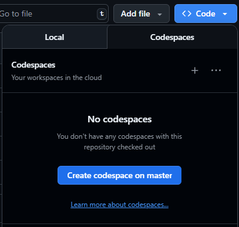

# 🚀 Sistema de Votación en Blockchain -- SUI

Sui es una plataforma de blockchain y contratos inteligentes de capa 1 diseñada para que la propiedad de activos digitales sea rápida, privada, segura y accesible.

Move es un lenguaje de código abierto para escribir programas seguros que manipulan objetos en la blockchain. Permite bibliotecas, herramientas y comunidades de desarrolladores comunes en blockchains con modelos de datos y ejecución muy diferentes.

---

## Proyecto

Este repositorio es un proyecto para manejar votaciones utilizando la blockchain de SUI. Permite crear propuestas con múltiples opciones, agregar votantes, emitir boletas y registrar votos de manera segura y transparente. Cada propuesta es controlada por su propietario, y cada votante recibe una boleta única para garantizar la integridad de la votación.

---

## Comenzando con Codespaces

### 1. Clona el Repositorio  
Copia este repositorio a tu cuenta de GitHub haciendo clic en el botón **Fork**. Puedes renombrar el repositorio según tu proyecto.


### 2. Abre en Codespaces  
Presiona el botón `<> Code` y navega a la pestaña **Codespaces**.



---

### 🧩 Estructura del Proyecto

El código fuente se encuentra en `sources/votacion.move`.  
El módulo `votacion` contiene las siguientes funciones y estructuras clave:

#### Estructuras
Se crearon 4 estructuras principales:  

- **Opcion:** Representa cada opción de una propuesta.  
- **Propuesta:** Contiene la pregunta, opciones, votos por opción, votantes y estado de finalización.  
- **Boleta:** Representa la autorización de un votante para participar en una propuesta.  
- **Voto:** Registra el voto emitido por un votante en una propuesta.

#### Funciones del Administrador

- `crear_propuesta`: Crea una nueva propuesta con opciones y registra al propietario.  
- `agregar_votante`: Añade un votante autorizado a una propuesta.  
- `emitir_boleta`: Genera una boleta para que un votante pueda emitir su voto.  
- `finalizar_votacion`: Marca la propuesta como finalizada, impidiendo más votos.  
- `obtener_resultados`: Devuelve el conteo de votos por opción.  
- `eliminar_propuesta`: Elimina una propuesta y limpia sus estructuras de datos asociadas.

#### Funciones para Votantes

- `votar`: Permite a un votante emitir su voto usando su boleta, actualiza los votos y marca que el votante ya ha votado.  

---

### Seguridad

El módulo emplea notificaciones de error para garantizar integridad y permisos:

```
#[error]
const NO_AUTORIZADO: vector<u8> = b"No tienes permisos para realizar esta acción";
#[error]
const PROPUESTA_YA_FINALIZADA: vector<u8> = b"La propuesta ha finalizado";
#[error]
const VOTO_YA_EMITIDO: vector<u8> = b"Este votante ya ha emitido un voto";
#[error]
const NO_ES_VOTANTE: vector<u8> = b"No estás autorizado para votar en esta propuesta";
#[error]
const BOLETA_INVALIDA: vector<u8> = b"La boleta no corresponde a esta propuesta";
#[error]
const OPCION_NO_EXISTE: vector<u8> = b"La opción seleccionada no existe";
```

Ademas se utilizan `assert!` para verificar que solo los propietarios puedan modificar las propuestas y que los votantes sean válidos:

```
assert!(propuesta.propietario == tx_context::sender(ctx), NO_AUTORIZADO);
assert!(propuesta.votantes.contains(&sender), NO_ES_VOTANTE);
```

---

### 💬 Interacción con el Contrato

Para interactuar con el contrato, utiliza la CLI de Sui. Algunos comandos básicos:

#### Crear Propuesta

```
sui client call
--package <ID_DEL_PAQUETE>
--module votacion
--function crear_propuesta
--args "Pregunta de Ejemplo" <VECTOR_OPCIONES>
--gas-budget 50000000
```

#### Agregar Votante

```
sui client call
--package <ID_DEL_PAQUETE>
--module votacion
--function agregar_votante
--args <ID_PROPUESTA> <DIRECCION_VOTANTE>
--gas-budget 50000000
```

#### Emitir Boleta

```
sui client call
--package <ID_DEL_PAQUETE>
--module votacion
--function emitir_boleta
--args <ID_PROPUESTA> <DIRECCION_VOTANTE>
--gas-budget 50000000
```

#### Emitir Voto
```
sui client call
--package <ID_DEL_PAQUETE>
--module votacion
--function votar
--args <ID_PROPUESTA> <ID_BOLETA> <ID_OPCION>
--gas-budget 50000000
```


#### Finalizar Votación

```
sui client call
--package <ID_DEL_PAQUETE>
--module votacion
--function finalizar_votacion
--args <ID_PROPUESTA>
--gas-budget 50000000
```


---

### 📦 Resumen

- Creación de propuestas con múltiples opciones.  
- Gestión de votantes y boletas únicas.  
- Registro seguro de votos y resultados.  
- Eliminación y finalización de propuestas.  
- Seguridad basada en permisos y validación de objetos NFT.  

---


